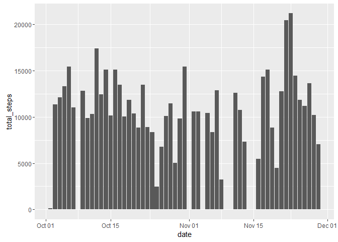
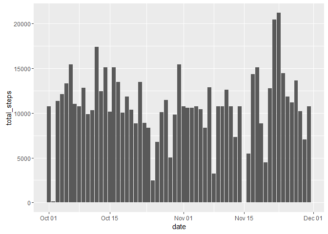
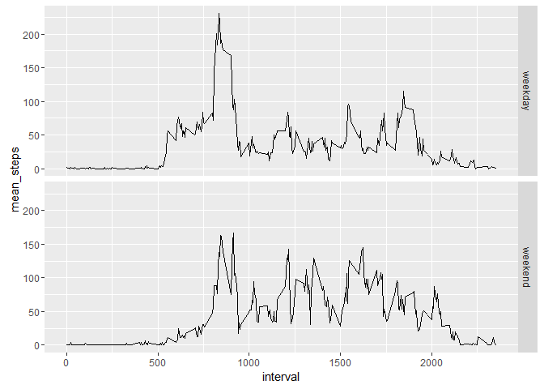

# PA1 Assignment
Mohamed Soliman  
August 9, 2016  


## 1. Code for reading in the dataset, Installing dependencies and processing the data  


```r
dataFile <- unzip(zipfile = "activity.zip")
activity <- read.csv(dataFile, stringsAsFactors=FALSE)
activity$date <- as.Date(activity$date)
if(!require(dplyr)) {install.packages("dplyr") ; library(dplyr)}
```

```
## Loading required package: dplyr
```

```
## 
## Attaching package: 'dplyr'
```

```
## The following objects are masked from 'package:stats':
## 
##     filter, lag
```

```
## The following objects are masked from 'package:base':
## 
##     intersect, setdiff, setequal, union
```

```r
if(!require(ggplot2)) {install.packages("ggplot2") ; library(ggplot2)}
```

```
## Loading required package: ggplot2
```


## 2. Histogram of the total number of steps taken each day


```r
total_steps_per_day <- activity %>% group_by(date) %>% summarise(total_steps = sum(steps))

ggplot(data=total_steps_per_day, aes(x=date, y=total_steps)) + geom_bar(stat="identity")
```

```
## Warning: Removed 8 rows containing missing values (position_stack).
```

<!-- -->


## 3. Mean and median number of steps taken each day


```r
mean_steps <- mean(total_steps_per_day$total_steps, na.rm = TRUE)

median_steps <- median(total_steps_per_day$total_steps, na.rm = TRUE)
```

The Mean Steps is 1.0766189\times 10^{4}, and the Median is 10765.


## 4. Time series plot of the average number of steps taken


```r
avg_steps_per_interval <- activity %>% group_by(interval) %>% summarise(mean_steps = mean(steps, na.rm = TRUE))

ggplot(data=avg_steps_per_interval, aes(x=interval,y=mean_steps)) + geom_line()
```

<!-- -->


## 5. The 5-minute interval that, on average, contains the maximum number of steps


```r
max_interval <- as.integer(avg_steps_per_interval[which(avg_steps_per_interval == max(avg_steps_per_interval)), 1])
```


## 6. Code to describe and show a strategy for imputing missing data


```r
total_missing <- sum(activity$steps)
```

Number of rows with missing value NA. 

We are going to replace the missing steps by the mean for that 5-minute interval.


```r
means <- avg_steps_per_interval$mean_steps
imputed_activity <- activity

for (inter in avg_steps_per_interval$interval){
 index <- which(avg_steps_per_interval$interval== inter)
 imputed_activity <- imputed_activity %>% mutate(steps=replace(steps, interval==inter & is.na(steps),means[index])) 
}
```


## 7. Histogram of the total number of steps taken each day after missing values are imputed


```r
total_steps_per_day_imputed <- imputed_activity %>% group_by(date) %>% summarise(total_steps = sum(steps))

ggplot(data=total_steps_per_day_imputed, aes(x=date, y=total_steps)) + geom_bar(stat="identity")
```

<!-- -->

```r
imputed_mean_steps <- mean(total_steps_per_day_imputed$total_steps)

imputed_median_steps <- median(total_steps_per_day_imputed$total_steps)
```

The Mean Steps is 1.0766189\times 10^{4}, and the Median is 1.0766189\times 10^{4}.


## 8. Panel plot comparing the average number of steps taken per 5-minute interval across weekdays and weekends

<!-- -->


